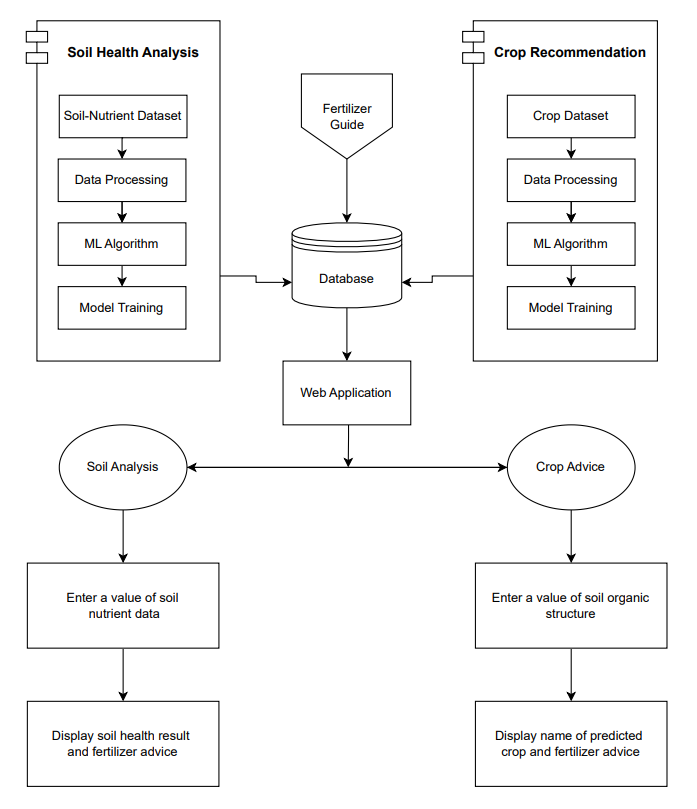

# 🌱 Smart Agro System for Tamil Nadu

An AI-powered system designed to **analyze soil health, recommend suitable crops, and provide fertilizer guidance** for farmers in Tamil Nadu.  
This project integrates **machine learning, data analytics, and a Flask-based web application** to enable **data-driven and sustainable agricultural decisions**.

---

## 📌 Project Overview

The **Soil Health Analytics System** assists farmers and agricultural stakeholders by assessing soil quality, recommending suitable crops, optimizing fertilizer usage, and improving agricultural productivity. Trained machine learning models generate accurate predictions, which are delivered through a **simple, intuitive, and user-friendly web interface**.

---

## 🎯 Key Features

### 🔬 Soil Health Analysis
- Predicts soil health status: **Poor, Fair, or Good**
- Prediction accuracy: **94.57%**
- Uses **12 soil parameters** including N, P, K, pH, Organic Carbon, EC, and micronutrients
- Provides actionable insights to improve soil quality

### 🌾 Crop Recommendation
- Recommends the most suitable crops based on soil and climate conditions
- Prediction accuracy: **99.55%**
- Uses **7 parameters**: N, P, K, temperature, humidity, pH, rainfall
- Supports informed crop selection decisions

### 🌿 Fertilizer Advice
- Personalized fertilizer recommendations
- Supports **organic and chemical fertilizers**
- Reduces cultivation cost and improves yield

### 💻 Web Application
- Built using **Flask**
- Clean, responsive, and user-friendly interface
- **Bilingual support** (English and Tamil)
- Accessible on mobile and desktop devices

---

## 🎥 Project Showcase

A complete demonstration of the application workflow is available at:

📁 **SHOWCASE**

[demo](SHOWCASE.md)

---

## 🏗️ System Architecture

---

## 📊 Machine Learning Models

**Soil Health Prediction Model**
- Algorithm: Stacking Classifier
- Base Models: Random Forest (2 variants), Gradient Boosting
- Accuracy: **94.57%**
- Classes: Poor (0), Fair (1), Good (2)

**Crop Recommendation Model**
- Algorithm: Random Forest Classifier
- Accuracy: **99.55%**
- Supported Crops: 22 crop types

---

## 📂 Project Resources

- 📊 Dataset documentation: [data/README.md](data/README.md)  
- 📓 Notebook workflows: [notebooks/README.md](notebooks/README.md)

---

## 👥 Target Users

- Farmers – Personalized soil analysis and crop recommendations  
- Agricultural Officers – Regional soil health monitoring  
- Students & Researchers – Machine learning applications in agriculture  
- Policy Makers – Data-driven agricultural planning  

---

## 🌍 Impact & Benefits

- 🌾 Increased crop yield through optimized crop selection  
- 💰 Reduced fertilizer and cultivation costs  
- 🌱 Improved soil health and sustainable farming practices  
- 📊 Scientific and data-driven agricultural decision-making  

---

## ✅ Conclusion

The **Soil Health Analytics System for Tamil Nadu** provides a practical and intelligent solution for modern agriculture. By combining **machine learning models**, **reliable agricultural data**, and a **user-friendly web platform**, the system empowers farmers and stakeholders to make **accurate, efficient, and sustainable farming decisions**, ensuring long-term agricultural productivity and soil conservation.

---
