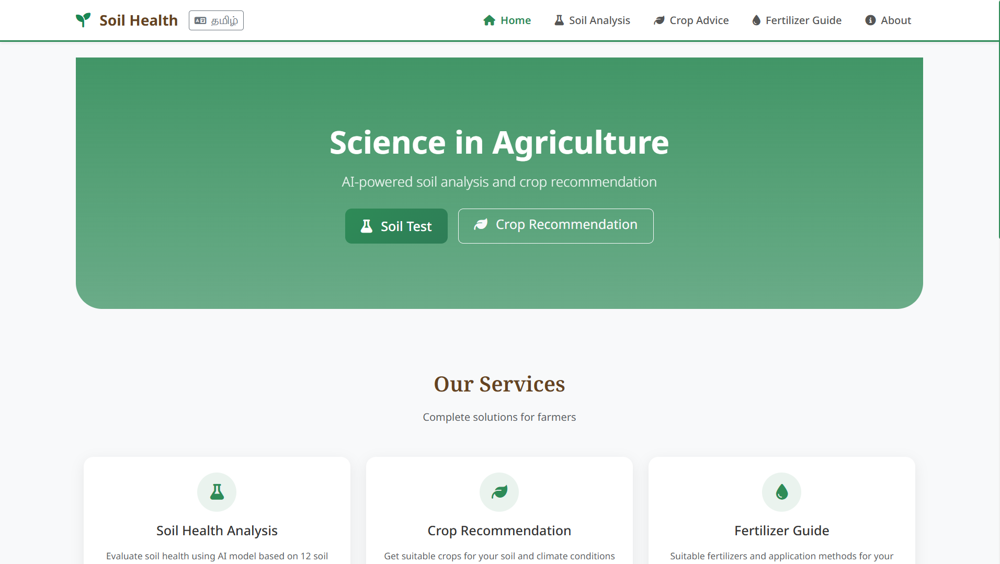
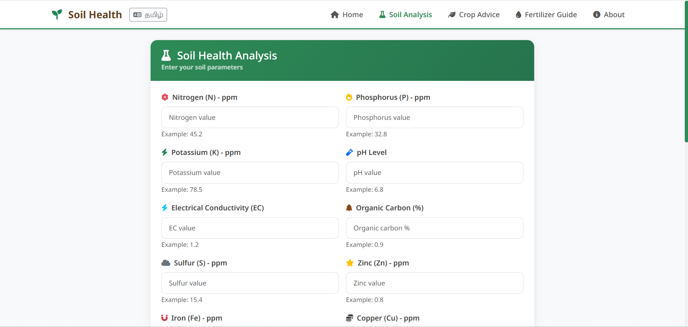
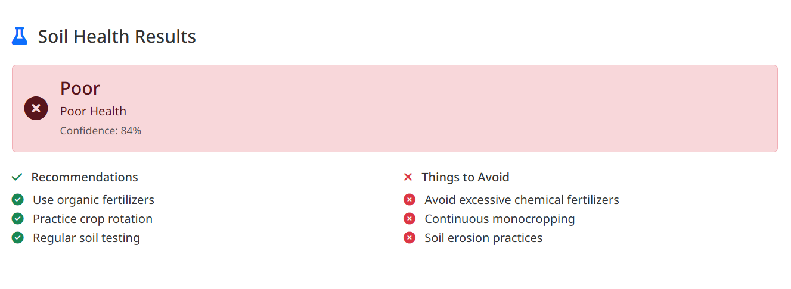
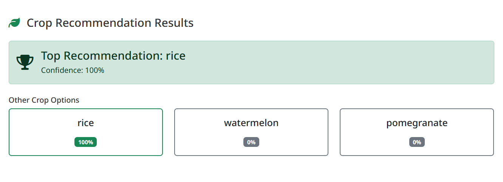
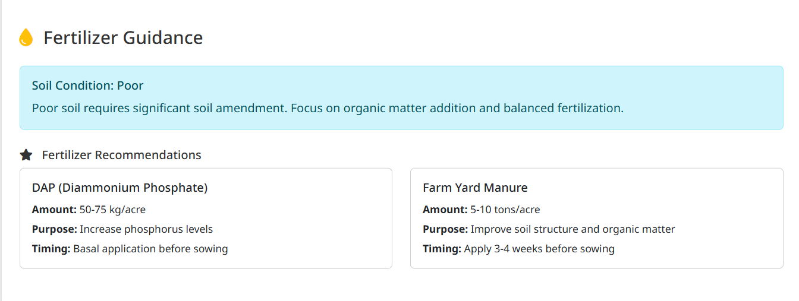

# 🌱 Smart Agro System - Showcase

AI-powered platform for **Soil Analysis, Crop Recommendation, and Fertilizer Guidance** with **English & Tamil support**.

---

## 🏠 Home Dashboard (English)

---

## 🏠 Home Dashboard (Tamil)

---

## 🧪 Soil Health Input

Enter soil parameters like N, P, K, pH, EC, and micronutrients.

---

## 📊 Soil Health Result

**Status:** Poor  
**Confidence:** 84%
  

---

## 🌾 Crop Recommendation

---

## 💧 Fertilizer Guidance

**Soil Condition:** Poor  

- **DAP:** 50–75 kg/acre (before sowing)  
- **Farm Yard Manure:** 5–10 tons/acre (3–4 weeks before)

---
## 🚀 Features

- AI Soil Analysis  
- Crop Recommendation  
- Fertilizer Guidance  
- Tamil + English Support 
